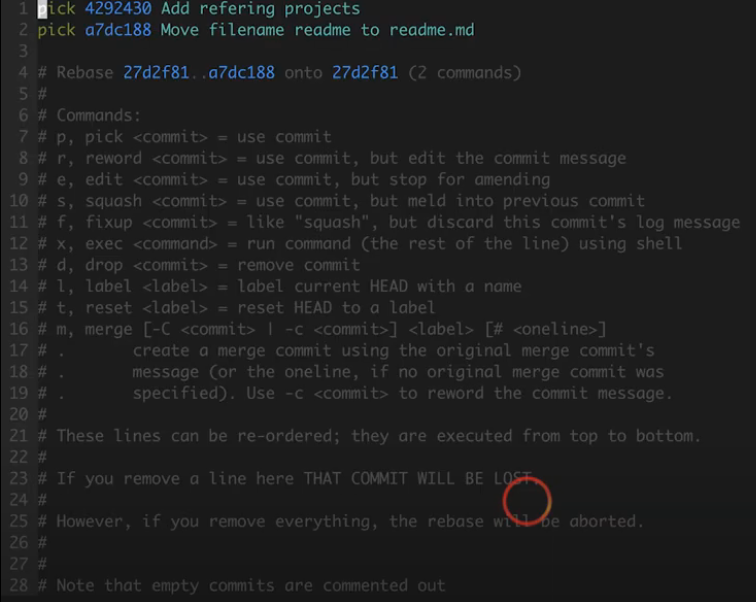
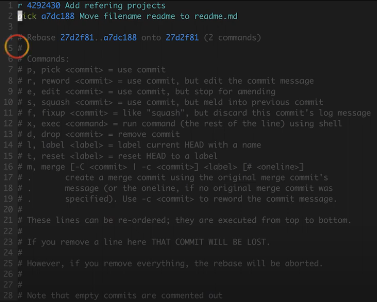
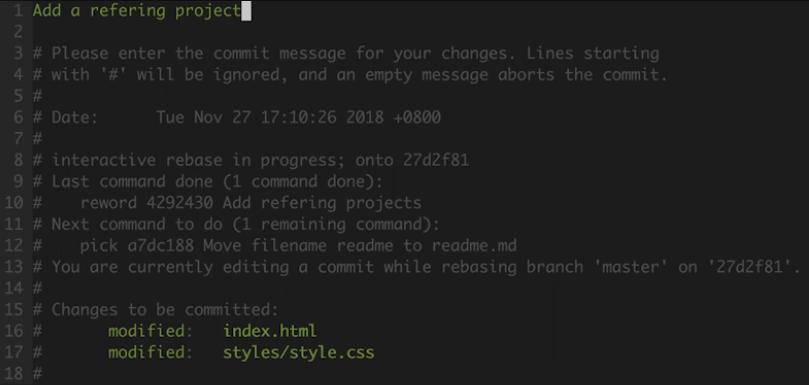
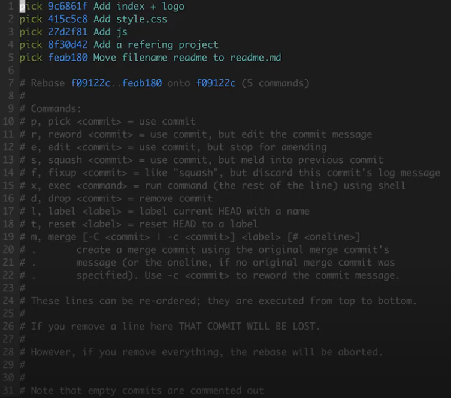
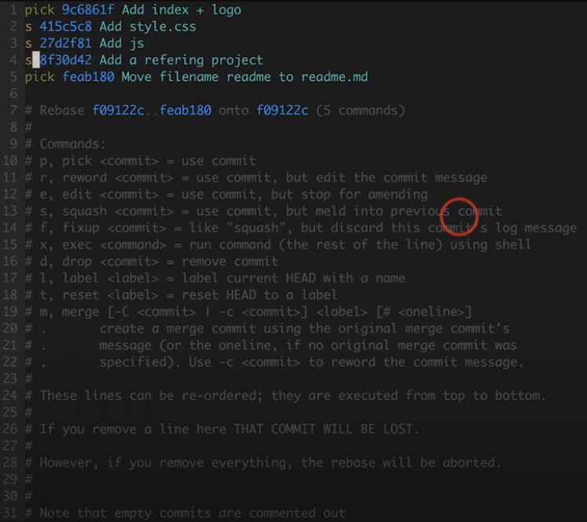
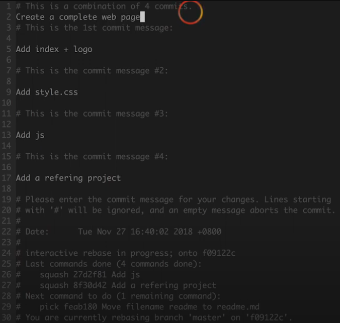
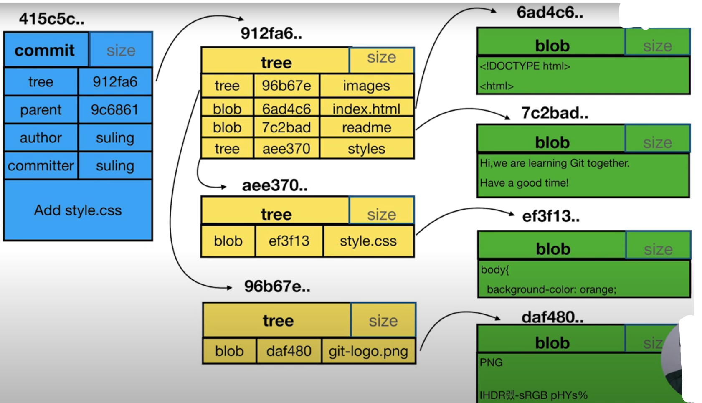

# Git
## 安装git
下载地址：https://git-scm.com/downloads

安装参考：https://git-scm.com/book/en/v2/Getting-Started-Installing-Git

查看git版本：
```
$ git --version
git version 2.46.0.windows.1
```

## 配置git
--local: 只对某个仓库有效，也是缺省值，优先级最高

--global: 对当前用户所有仓库有效，最常用的

--system: 对系统所有登录的用户有效
```
$ git config --global user.name 'your_name'
$ git config --global user.email 'your_email@domain.com'
```
查看配置，使用--list
```
$ git config --global --list
user.name=frodelee
user.email=frodeli@163.com
```
## 常用命令
以简洁的单行显示方式查看当前分支最近的5次提交log：
```
$ git log -n5 --oneline
```


以图形化的方式查看所有分支的提交日志：
```
$ git log --all --graph
```


以图形化，简洁的方式查看最近5次所有分支的提交日志：
```
$ git log --oneline --all -n5 --graph
```


打开图形界面：
```
$ gitk
```


查看所有分支名称及最近一次的信息：
```
$ git branch -av
```

将当前的修改隐藏，修复突如其来的线上问题, 当线上问题修复后，再拿出之前隐藏的修改：

隐藏当前的修改：
```
$ git stash
```

查看隐藏的列表：
```
$ git stash --list
```

拿出隐藏的修改，但是不删除隐藏的修改：
```
$ git stash apply
```

拿出隐藏的修改，同时删除隐藏的修改：
```
$ git stash pop
```

根据hash值查看对应的文件类型（commit/tag/tree/blob）:
```
$ git cat-file -t <commit_hash>
commit
```

根据hash值查看对应的文件内容:
```
$ git cat-file -p <commit_hash>
tree fc2867590e0e68230e7b4779a7de1ff5bf0b69f7
parent f75d6b6b1905b856d2590c495cf27bccd75c5a2d
author frodelee <frodeli@163.com> 1725288921 +0800
committer frodelee <frodeli@163.com> 1725288921 +0800

add Document/git.md
```

比较工作区和暂存区所有的差异：
```
$ git diff
```

比较工作区和暂存区特定文件的差异：
```
$ git diff -- styles/style.css
```

比较暂存区和HEAD的差异：
```
$ git diff --cached
```

根据hash对比差异：
```
$ git diff <commit_hash_1> <commit_hash_2>
```

根据HEAD对比差异(^代表上一次commit)：
```
$ git diff HEAD HEAD^
$ git diff HEAD HEAD^^
```

根据HEAD对比差异(~1代表上一次commit)：
```
$ git diff HEAD HEAD~1
```

清除全部暂存区，恢复到和当前分支的HEAD一致：
```
git reset HEAD
```

清除部分暂存区文件，恢复到和当前分支的HEAD一致：
```
git reset HEAD -- styles/style.css index.html
```

将工作区文件变回到跟暂存区一致：
```
$ git checkout -- index.html
```

删除无用的分支：
```
$ git branch -D <branch_name>
```

删除最近几次的commit,回退到某个commit(谨慎使用):
```
$ git reset --hard <commit_hash>
```

修改当前分支最近一次提交的描述信息：
```
$ git commit --amend
```

修改历史提交中的描述信息：
> #注意：-i是进入交互模式，后面需要填写你要修改的commit的上一次commit的hash，也就是先变基，回车进入第一次的交互界面后，将要修改的commit前面的pick改为r或者reword，reword命令是保留对应commit的文件，只修改描述信息，然后保存并退出，就会进入第二次交互界面，此时就可以修改那个commit的描述信息了。修改完后再保存退出。该操作会更新HEAD分支的commit hash，但是不会更改任何文件内容。
```
$ git rebase -i 27d2f8146e
```
第一次进入交互界面：



修改commit前面的命令为r或reword:



第二次进入交互界面，修改commit的描述信息：



合并多个连续的commit为一个commit:
> 注意：-i进入交互界面，后面跟要合并的commit中最早的一个commit的上一个commit hash，也就是先变基，且只能合并连续的几个commit到他们前一个commit中，所以还要再最前面保留一个commit,然后将后面要合并的commit前面的pick命令改为s或者squash，保存并退出，第二次进入交互界面，可以填写message说明为什么要合并这几个commit，然后保存退出。该操作会更新HEAD分支的commit hash，但是不会更改任何文件内容。
```
$ git rebase -i f09122cf21
```
第一次进入交互界面：



将要合并的commit前面的pick命令为s或squash:



第二次进入交互界面，填写message说明为什么要合并这几个commit：



## 多人合作
当多人基于同一个分支进行协作时，其他人修改了不同的文件或者同一文件的不同区域，并且已经push到公共仓库中，自己还处于开发中，当自己开发完了后push时会被拒绝，同时提示fast-forwards，解决方法：先用fetch命令拿到远端仓库最新的全部分支，然后将本地的分支merge过去，再push.
```
$ git fetch
$ git merge origin/<branch_name>
$ git push origin <branch_name>
```

## commit,tree,blob三个对象的关系
commit: 代表一次提交，是此次提交中所有文件夹及文件的快照；

tree：代表文件夹，里面可能有子文件夹或文件；

blob：代表文件，git里面不会有重复的文件，只要内容一样就只会有一份；

git通过这种树形结构保存信息，然后根据hash一层一层寻找文件。




## .git文件夹
全部文件列表：
```
Mode                 LastWriteTime         Length Name
----                 -------------         ------ ----
d-----         2023/4/17     22:57                hooks
d-----         2023/4/17     22:57                info
d-----         2023/4/17     22:57                logs
d-----         2023/4/17     23:42                objects
d-----         2023/4/17     22:57                refs
-a----          2024/9/2     22:55             20 COMMIT_EDITMSG
-a----          2024/9/2     22:30            419 config
-a----         2023/4/17     22:57             73 description
-a----          2024/9/2     22:59            225 FETCH_HEAD
-a----          2024/9/2     22:41            342 gitk.cache
-a----          2024/9/2     22:54             24 HEAD
-a----          2024/9/2     22:55            435 index
-a----          2024/9/2     22:53             41 ORIG_HEAD
-a----         2023/4/17     22:57            185 packed-refs
```
HEAD： 它描述了我们当前工作的分支，如果切换了分支，HEAD文件也会随之改变。

config： 它存放了跟本地仓库相关的配置信息。

refs： 描述了全部分支索引和tag信息。

objects: 存储了全部文件及hash值。