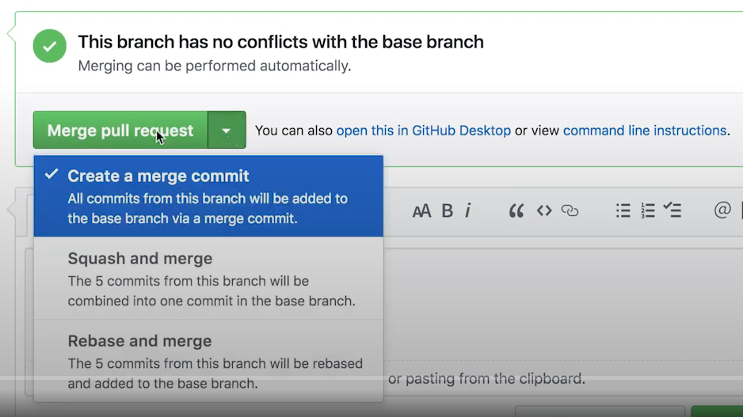
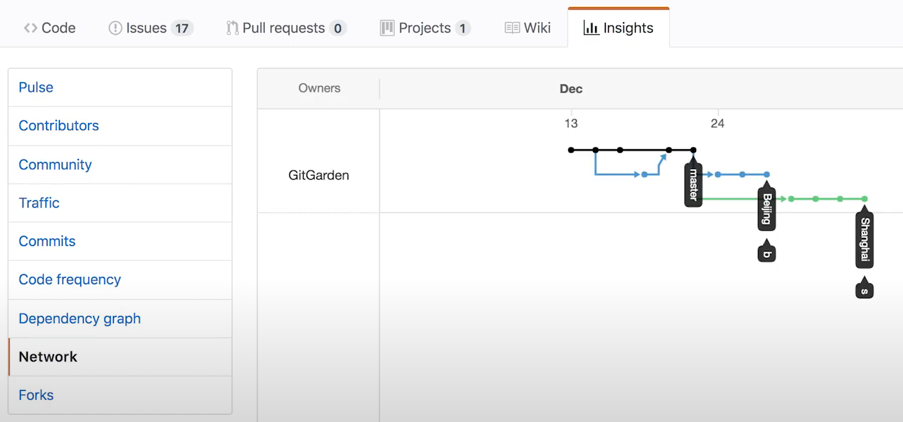
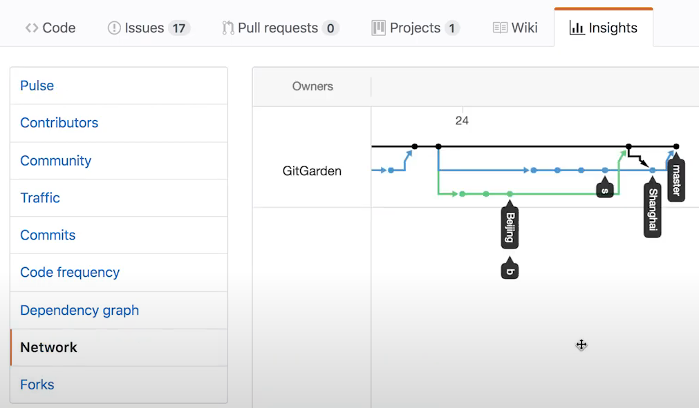
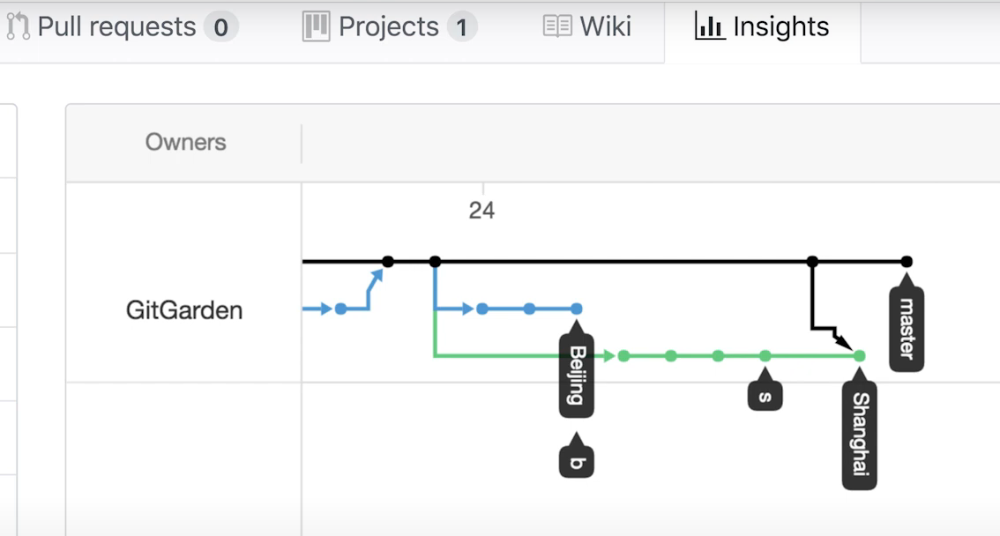
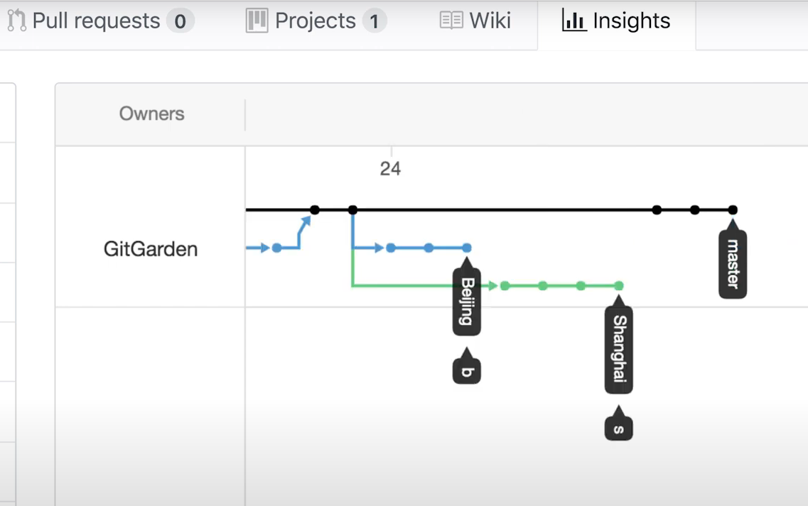
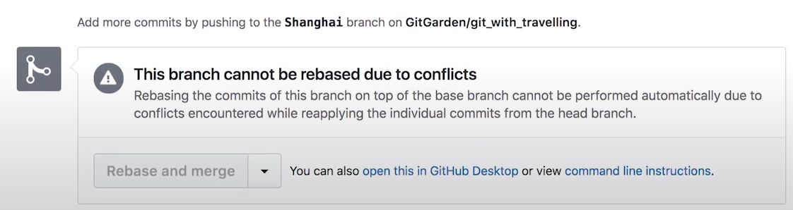
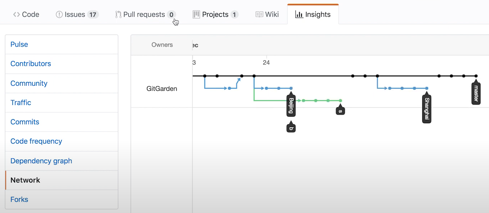

# Git
## 三种merge方式比较
三种merge方式：



此次说明这三种merge的区别是基于一个例子，未merge之前的分支情况如下图：



### Create a merge commit
先合并Beijing分支，再合并Shanghai分支并解决冲突后，都选择`Create a merge commit`的方式合并，合并后如下图：



### Squash and merge
先合并Beijing分支，再合并Shanghai分支并解决冲突后，都选择`Squash and merge`的方式合并，合并后如下图：



### Rebase and merge
先合并Beijing分支，选择`Rebase and merge`，合并后分支情况如下图：



然后再合并Shanghai分支，解决完冲突后，发现github无法完成通过rebase的方式进行合，会显示下图中的提示：



这时候就需要我们手动处理了，有两种方法，第一种方法是在rebase时一个一个地去解决每个冲突文件，第二种方法是使用rerere命令，先解决全部冲突文件并记录，然后再rebase。第一种方法步骤如下：
1. 首先将Shanghai分支回退到再github上解决冲突之前的状态：`git push -f 6ac0f:Shanghai`
2. 然后同步一下远端的分支：`git fetch origin`
3. 切换到Shanghai分支：`git checkout Shanghai`
4. 基于origin/master进行rebase：`git rebase origin/master`
5. 解决冲突文件：`vi readme`，然后保存退出
6. 将解决冲突后的文件添加到暂存区：`git add readme`
7. 继续执行rebase continue：`git rebase --continue`
8. 如果还有冲突文件，则重复第5步执行，直到不在提示冲突为止
9. 将rebase后的Shanghai分支推送到远端：`git push origin Shanghai`
10. 远端通过`Rebase and merge`的方式进行合并

第二种方法步骤：
1. 首先将Shanghai分支回退到再github上解决冲突之前的状态：`git push -f 6ac0f:Shanghai`
2. 配置rerere命令生效：`git config --global rerere.enable true`
3. 切换到Shanghai分支：`git checkout Shanghai`
4. merge到master分支：`git merge master`
5. 解决全部的冲突文件：`vi readme`，然后保存退出
6. 将解决冲突后的文件添加到暂存区：`git add .`
7. 提交commit：`git commit -m "temp"`
8. 回退到上一个commit：`git reset --hard HEAD^`
9. 基于origin/master进行rebase：`git rebase master`
10. 这是会提示冲突，但是打开冲突文件会发现冲突文件已经被处理好了，只需要添加暂存区并继续执行rebsase continue：
```
git add .
git rebase --continue
```
11. 直到rebase continue命令不在提示冲突信息
12. 将rebase后的Shanghai分支推送到远端：`git push origin Shanghai`
13. 远端通过`Rebase and merge`的方式进行合并

最终通过Rebase and merge方式合并的两个分支情况如下图：

